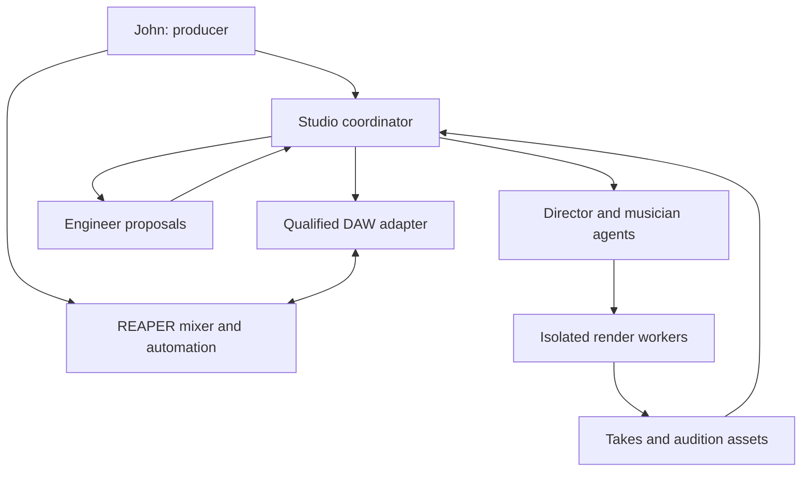

# LLM Studio — Product and Engineering Specification

Version: 0.2 · Date: 2026-09-06 · Owner: John / cotyledonlab

Status: Revised implementation baseline. Rendering qualifications are complete; REAPER integration and the end-to-end acceptance gates remain open.

Repository: [cotyledonlab/llm-studio](https://github.com/cotyledonlab/llm-studio).

## 1. Product intent

John is the producer. A team of agents acts as session musicians, arranger, sound designer and mix engineer. They create alternative performances, render instruments, audition material where audio capabilities permit, and propose improvements. John chooses the direction and takes, and can personally move faders, edit processing parameters and draw or record track automation in a conventional DAW.

The studio must communicate through software APIs, scripting interfaces and audio/MIDI protocols. It must never depend on agents clicking, typing into, visually locating or screen-scraping DAW controls. A human-operated DAW GUI is desirable; automating that GUI is not.

The primary experience is: describe the music, receive playable takes, select and direct the ensemble, then mix with either direct controls or delegated engineering assistance. The output is an editable session with separate parts and preserved source material, not merely a generated stereo audio file.

## 2. User requirements and assumptions

### Confirmed requirements

- REAPER is the selected DAW, and its paid licence is an accepted studio prerequisite.
- Retain direct human control over mix parameters and track automation.
- Agent operation must not use computer-use automation.
- Support multiple functional agents with distinct musical/engineering responsibilities.
- Grow towards broad stylistic competence and a wide sound palette.
- Reuse successful existing Pure Data, SuperCollider and REAPER connector work where useful. SuperCollider is the preferred existing synthesis capability.
- Avoid repeating the Logic connector's broad infrastructure investment before the first successful musical workflow.

### Design assumptions

- Initial host: John's Apple Silicon Mac, with a supported pinned OS/audio setup. Linux is a later supported platform, not a prerequisite imposed on the user.
- The first workflow is asynchronous production and short rendered auditions. Low-latency live jamming is a later project.
- Third-party instruments are provisioned and qualified deliberately; agents never install an arbitrary plugin during a take.
- REAPER, model inference, storage and optional sound costs must be visible separately. A free qualified instrument baseline remains desirable, but no-purchase DAW operation is no longer a requirement.
- Requirements below are binding for this proposal; backend choices remain conditional on the feasibility gates. A failed gate must not silently weaken the manual-control or no-computer-use requirements.

## 3. First useful release

The first release produces an eight-bar arrangement with drums, bass and keys, using a small qualified instrument set. It returns two or three alternatives, lets John select takes, places them in an editable DAW session, and allows John to change gain, pan and a volume automation curve himself. A subsequent agent revision must preserve those manual choices.

The first release includes one engineer agent capable of proposing a static balance and one bounded volume-automation change. It does not need to demonstrate every genre, autonomous mastering, complex routing, vocal synthesis or universal plugin support.

### Required demonstration

1. John supplies an eight-bar brief, tempo, meter and harmonic outline.
2. A director produces a shared arrangement; drummer, bassist and keys roles generate parts against that exact revision.
3. Isolated workers render dry stems and short audition mixes.
4. John selects takes and imports them through the studio's programmatic session adapter.
5. In the DAW, John lowers the bass by 2 dB and draws a keys volume ramp.
6. John asks for a less busy drummer and an engineer's suggested keys ramp.
7. A new drum take replaces only its approved musical content. Bass gain and the human keys ramp remain unchanged.
8. The engineer's overlapping ramp is presented as a conflict/alternative, never silently applied.
9. John deliberately accepts an engineering proposal, then can undo it without losing unrelated work.
10. Save, close and reopen preserve the session, chosen takes, automation and asset references. Export a stereo mix and aligned stems.

Success is hearing a useful arrangement while retaining practical control of the mix. Passing protocol tests alone is insufficient.

## 4. Architecture decisions

| Concern | Initial decision | Rationale / boundary |
|---|---|---|
| Human mixer and timeline | REAPER, conditional on the revised Gate A | John accepts its licence cost; existing integration evidence makes it the practical editable DAW. |
| DAW agent interface | Adopt `reaper-controller` behind a thin studio adapter | Reuse its ReaScript file bridge, OSC, MIDI, RPP and headless-render lanes instead of starting another connector. |
| Existing synthesis | Qualified SuperCollider NRT pattern | Reuse the adjacent connector's mechanics and SynthDefs selectively, not its current API unchanged. |
| Additional plugin renderer | Pedalboard with Dexed | Real restart/render evidence passed; consider DawDreamer only after a concrete requirement fails. |
| Coordinator | Small local service, proposed TypeScript | Own jobs, approvals, revisions and persistence; models remain replaceable. |
| Audio workers | Python / existing SuperCollider process | Keep model latency and failures outside the audio callback. |
| Persistence | SQLite plus immutable local assets and native DAW session | No distributed database or cloud dependency for the first release. |
| Agent interface | Semantic MCP tools over the coordinator | Workers receive bounded jobs; only coordinator may write accepted session changes. |
| Producer interface | REAPER plus a minimal take/proposal view | Do not build a replacement mixer, piano roll or automation editor. |

### 4.1 REAPER rationale and current evidence

The Ardour investigation ended in a documented no-go on the target Mac: no runnable no-purchase build was produced, and essential native operations could not be qualified. John has accepted REAPER's licence cost because prior LLM-assisted results and the existing controller justify the practical value.

The adjacent `reaper-controller` already has observed REAPER 7.79/macOS-arm64 evidence for a deferred Lua bridge, exact mixer/FX readback, OSC transport and telemetry, MIDI insertion, RPP generation/reading, and headless rendering. This is strong reuse evidence, not automatic completion of LLM Studio Gate A. Envelope range read/write, external-edit freshness, atomic conflict application, mix-preserving take replacement, safe undo and the complete reopen/export tracer still require real qualification.

Adopt the controller as a versioned dependency or deliberately move a bounded adapter into this repository with provenance. Do not fork its protocols casually or build a second generic REAPER connector.

### 4.2 Integration boundary

Use REAPER's background interfaces even when its GUI is visible. Headless interactive operation is not required; agents must need no mouse, keyboard focus or screen interpretation.

The primary semantic lane is the existing deferred ReaScript Lua file-drop bridge. OSC is reserved for transport, telemetry and other high-rate controls; RPP files and `-renderproject` handle bulk authoring and offline verification. A request is not successful until the relevant state is observed back. No model call, network wait or unbounded work belongs in an audio callback.

Studio bootstrap may copy approved scripts, create bridge queues and install deterministic configuration from a reviewed plan. It must back up changed files, be idempotent, refuse changes while unsafe, and report any step that still needs the producer inside REAPER. Setup automation must not become GUI automation.

### 4.3 Rendering boundary

Pedalboard documents MIDI rendering through VST3/AU instruments and programmatic effects [S3]. DawDreamer documents processor graphs, MIDI, automation and rendering [S4]. Gate B selects the smallest backend satisfying the initial instrument and state-recall tests.

Default accepted tracks contain dry or intentionally sound-designed stems. Mix gain, pan, sends and editable mix automation remain in REAPER. Timbre-changing instrument automation may be baked into an audition stem, but the performance and patch state must be retained so it can be rendered again. The UI must distinguish this from directly editable DAW automation.

Do not claim that a stem permits editing a rendered synth filter without rerendering. Later qualification may allow an instrument to run natively in REAPER with its automation exposed there.

## 5. Component relationships



An agent is a bounded role with tools and persistent artifacts, not necessarily a permanently running process. Generation can run concurrently; accepted session writes are serialized. One audio engine owns live session playback. Render workers normally write files and need no audio-device access.

## 6. Authority and source of truth

There is no duplicated, independently writable mirror of the DAW mix.

| Data | Authority | Coordinator behaviour |
|---|---|---|
| Current audible mix, routing, plugin parameters and automation | Native REAPER session | Observe and version relevant state; apply approved changes through adapter. |
| Musical brief and accepted structural plan | Coordinator arrangement revision | Validate generation against revision; reconcile intentional DAW changes. |
| Generated performances and alternate takes | Immutable studio assets | Never overwrite an accepted take in place. |
| Instrument installation/capability information | Local qualified catalogue | Store exact versions, hashes and validation status. |
| Human mix edits | Native DAW state | Preserve; treat as external changes that can invalidate proposals. |
| Render cache | Derived data | Rebuild from pinned assets; never use as authority for a manual edit. |

The coordinator stores stable studio IDs and qualified DAW IDs together. Names, track indices, selected objects and screen positions are not identity. Reorder/rename must preserve binding; deletion must explicitly orphan the binding. A session switch invalidates outstanding write leases.

DAW edits to tempo, meter or region placement invalidate dependent arrangement jobs. The user can adopt the DAW state as a new arrangement revision or keep the old plan for comparison. The coordinator must not move the DAW back to match a stale plan.

## 7. Human and agent collaboration rules

### 7.1 Default authority

John may edit the DAW whenever he wants. Agents may continue generating alternatives while he mixes. Agents do not concurrently write the same live controls. Proposed changes are cheap and automatic; applying them follows the scope John has delegated.

Two initial application scopes are sufficient:

- **Take acceptance:** permission to insert/replace the specified part, preserving channel processing and automation.
- **Engineering application:** permission to change the listed controls or envelope ranges from the stated baseline.

A user request such as “apply that balance” authorizes the concrete proposal; do not request repeated confirmation for each fader. Generation, rendering and read-only analysis need no per-step approval. Existing manual controls outside the delegated scope are never changed.

### 7.2 Conflict handling

Each proposal identifies target IDs, expected state fingerprints, affected time range, preconditions and expected result. The coordinator re-observes those targets immediately before application. Stale state returns a conflict and no write.

If John touches an affected fader, edits an envelope or removes a plugin, invalidate that proposal. Independent controls can be rebased after a new observation, but overlapping changes require a regenerated or explicitly reaccepted proposal.

Do not assume compare-and-swap semantics exist in an external DAW protocol. Strict “human wins” needs either atomic comparison/application within the adapter's serialized DAW context, or an explicit short producer handoff that excludes concurrent editing of the affected controls. Gate A must establish one of these. A client-side read followed by a separate write is not sufficient for a zero-overwrite guarantee. Until qualified, use preview-only engineering proposals.

The first release may use an explicit “Apply this change” handoff. It must not require locking the whole computer, stealing focus or preventing unrelated editing while agents render.

### 7.3 Automation semantics

- Read and preserve each lane's mode, time domain, interpolation, boundaries and existing points.
- Express edits as a bounded range patch, not wholesale envelope replacement.
- Preserve points outside the range. Include explicit boundary values so the patch does not create unintended jumps.
- Static fader changes must respect current automation mode. Do not secretly disable Play, write into Touch/Write mode, or claim a static setting overrules the active curve.
- Track gain is represented in dB at the studio boundary, with silence represented explicitly; convert using the backend's actual gain law.
- Plugin automation uses stable plugin identity and parameter metadata, not a guessed normalized index. Pin the plugin version and resolve indices from discovery where unavoidable.
- Observe manual changes through qualified events or bounded polling. If freshness is uncertain, invalidate write eligibility rather than claim synchronization.
- Human automation must survive accepting a new musical take on the same logical track.

### 7.4 Undo

Use one native undo transaction per accepted proposal where supported. Never blindly issue global Undo after unrelated human edits. If native undo cannot safely identify the studio operation, offer a compensating patch that checks the affected values, or an explicit checkpoint restore that discloses all intervening changes it would replace.

## 8. Musical representation

The arrangement contains sections, meter map, tempo map, harmonic landmarks, track roles, groove instructions and approved structural constraints. Pitch and timing are data, not strings parsed back from prose.

- Absolute musical position: integer ticks from session start, initial PPQ 960.
- Note onset: integer ticks relative to the part's start; duration positive for sustained notes.
- Render position: integer samples at an explicit sample rate.
- Tempo/meter maps are versioned. Meter affects bar presentation; never assume every bar has four quarter notes.
- PPQ conversions must be exact or report quantization explicitly. Support triplets at the baseline; unsupported subdivisions fail validation rather than silently round.
- MIDI pitch 0–127, attack velocity 1–127, public channel 1–16. Normalize backend conventions in adapters.
- Preserve controllers, sustain, pitch bend, aftertouch and articulation instructions when used. A note-only adapter must reject richer performances or require an explicit lossy conversion.
- Program changes, bank selection and keyswitches belong to the instrument mapping and are included in the rendered performance trace.

Every role receives the same tempo/meter revision and agreed musical landmarks. A drummer/bassist coordination pass can exchange accepted rhythm data before rendering. All parts still receive ensemble-level audition; individually plausible parts do not establish a coherent band.

## 9. Agent roles and practical musicianship

| Role | Inputs | Outputs | Must not do |
|---|---|---|---|
| Director | Brief, references, producer decisions | Form, harmony, role briefs, arrangement constraints | Expand budget or rewrite accepted structure without permission. |
| Drummer | Groove, form, bass guide if available | Patterns, fills, velocity/articulation data, takes | Fill every gap or vary timing randomly as a substitute for groove. |
| Bassist | Harmony, kick pattern, register limits | Bass line, articulation and dynamics | Ignore playability/range or compete blindly with lead material. |
| Keys/guitar/other musician | Instrument brief, harmony and context | Playable voicings/phrases and variants | Claim all styles/instruments are qualified. |
| Sound designer | Timbre brief, catalogue | Patch/sample selection and recallable state | Require an unqualified GUI-only preset-loading workflow. |
| Engineer | Chosen stems, session state, references | Balance/processing proposals and comparisons | Overwrite protected manual work or judge only from loudness metrics. |

A role definition records range, articulation vocabulary, voice-leading/playability checks and representative examples. Style packs are separate, versioned assets: groove conventions, harmonic habits, arrangement density, instrumentation and human-reviewed demonstrations. Expansion is evidence-based; “all styles” is a long-term catalogue goal, not a v1 acceptance claim.

The initial demo can use an electronic groove and a contrasting acoustic-style groove. Only claim those qualified once John finds representative results musically useful. Higher-fidelity guitars, winds and vocals may require different samples or specialist models later.

Agents that cannot consume audio may perform symbolic planning and numerical checks, but must label their evaluation accordingly. They cannot report that they listened. Audio-capable evaluators receive the actual render, the brief and relevant context. John remains the final musical judge.

## 10. Instrument and sound catalogue

Start with one drum kit, one bass, one keys sound and a small SuperCollider/Surge palette. Expansion should improve sounds and playability rather than merely increasing the number of installed plugins.

Each instrument entry contains:

- Stable catalogue ID, instrument name, backend, plugin/library version and binary hash.
- Asset locations and checksums; licence/provenance and whether redistribution is allowed.
- Category, timbre descriptors, useful register and supported articulations.
- Parameter metadata, units, ranges, defaults, controller/keyswitch mappings.
- Patch/preset state hash and fully programmatic load/restore procedure.
- Sample-rate support, channels, CPU/RAM estimate, tail/preroll needs and observed latency.
- Qualification evidence for load, render, save/restore, cancellation and process restart.
- Short searchable audition examples rendered with consistent input phrases.

Candidates: SuperCollider [S5], Surge XT [S6], sfizz with qualified SFZ libraries [S7], FluidSynth with licensed SoundFonts [S8], and VSCO CE for an initial orchestral exploration [S9]. These are options, not mandatory simultaneous integrations.

Search returns a small candidate set and auditions. Do not send thousands of preset descriptions into every agent context. A producer's chosen sound can be locked for subsequent arrangement revisions.

The renderer's GPL or other licence does not establish the sample library's licence. Free-of-charge content is not automatically redistributable. Store provenance and attribution; do not commit commercial or unlicensed samples to the repo.

### 10.1 Catalogue provisioning

Agent-assisted plugin setup is future scope, but it is a governed supply-chain workflow rather than an open-ended tool call. A provisioning plan names an approved catalogue entry, pinned source and version, expected hashes/signatures, licence and content terms, target locations, disk/network requirements, rollback procedure and any unavoidable account, payment or GUI step. The producer reviews the plan before acquisition or installation.

The provisioner may automate downloads and user-level installation only from allow-listed sources, verify artifacts before execution, preserve existing plugin/configuration state, and invoke REAPER rescanning through a qualified background mechanism. Installers requiring elevated privileges, account login, licence acceptance, purchase, or changes outside declared paths require an explicit producer handoff. A successful install is not a qualified instrument: the workflow must still load it headlessly, restore a pinned state after restart, render a fixture, measure it, and add catalogue evidence before any musician can select it.

Provisioning never occurs during a take or against the live audio process. Uninstall and rollback must be explicit, and commercial samples, credentials and native binaries remain outside the repository.

## 11. Render service

### Job contract

A render job includes job ID, arrangement revision, part/performance hash, backend version, instrument state hash, sample rate, channel layout, start/end positions, preroll, tail length, deterministic seed where supported, resource limit and an absolute deadline.

Worker steps: validate dependencies; initialize an isolated engine; restore patch; schedule the complete phrase; render dry audio and requested intermediate stems; measure basic properties; write temporary outputs; atomically publish assets and metadata on success.

The agent never supplies realtime note timing through successive network calls. Notes and curves are scheduled ahead of rendering. Live preview may play the returned audio through REAPER.

### Audio correctness

- Session default: 48 kHz, stereo or explicitly declared mono; use 32-bit floating-point intermediate WAVs.
- Preserve headroom. Do not normalize every stem independently by default.
- Render all stems against a common start time; retain silence and offsets needed for alignment.
- Include effect tails and release stages beyond the musical endpoint. Tail trimming is explicit.
- Qualify latency reporting/compensation with impulse or transient tests; retain measured offsets in metadata. Do not double-compensate when importing into REAPER.
- Store dry and processed versions when sound design bakes an effect that may need revision.
- A plugin may be nondeterministic. Record reproducibility as bit-exact, tolerance-bounded or unqualified; do not promise identical audio solely because the MIDI and seed match.

### Resource isolation

Default to at most two render workers on the initial Mac, adjustable after measurement. Reserve CPU/RAM for responsive DAW playback. Pause new jobs if memory pressure or audio xruns exceed the configured limit.

Use process isolation for crash-prone native plugins. Timeouts terminate the worker process group after a grace period, mark the job failed and retain useful logs. Never terminate the producer's DAW to cancel a render.

## 12. Persistence, revisions and file layout

Proposed local project layout:

```text
project.json
studio.sqlite
arrangements/<revision>.json
performances/<content-hash>.json
instruments/<state-hash>/
takes/<take-id>/manifest.json
takes/<take-id>/dry.wav
takes/<take-id>/audition.wav
proposals/<proposal-id>.json
session/<native-reaper-project>/
exports/<export-id>/
```

SQLite records job states, revision links, target bindings and proposal outcomes. Audio assets are immutable and referenced by hash. Import/copy accepted media into the session's durable storage so reopening does not depend on a temporary worker directory. Missing source assets must be surfaced before an edit or rerender.

Persist a journal for external DAW operations. A worker result is either fully published or absent. A session application can be partial because a DAW is not a transactional database; record each completed step and observed effect.

On coordinator restart, do not blindly retry an ambiguous write. Inspect the target for the expected postcondition, reconcile the journal, and return succeeded, partial, conflicted or unknown. Unknown outcomes require reconciliation before another write to that scope.

## 13. Proposed domain contracts

These names belong to LLM Studio; they are not claims about existing `reaper-controller` method names. Implementation should publish JSON Schema and fixtures after Gate A, without building a large generic schema framework first.

### 13.1 Arrangement example

```json
{
  "schemaVersion": 1,
  "arrangementId": "arr_demo",
  "revision": 3,
  "ppq": 960,
  "tempoMap": [{"tick": 0, "bpm": 100}],
  "meterMap": [{"tick": 0, "numerator": 4, "denominator": 4}],
  "sections": [{"id": "sec_a", "startTick": 0, "lengthTicks": 30720}],
  "tracks": [
    {"id": "trk_drums", "role": "drums", "instrumentId": "kit_qualified_01"},
    {"id": "trk_bass", "role": "bass", "instrumentId": "bass_qualified_01"},
    {"id": "trk_keys", "role": "keys", "instrumentId": "keys_qualified_01"}
  ]
}
```

### 13.2 Scoped automation proposal example

```json
{
  "schemaVersion": 1,
  "proposalId": "prop_keys_ramp_02",
  "sessionId": "session_demo",
  "arrangementRevision": 3,
  "target": {"trackId": "trk_keys", "parameterId": "track.gain"},
  "expectedTargetFingerprint": "sha256:<observed-target-state-hash>",
  "kind": "replaceAutomationRange",
  "timeDomain": "musicalTicks",
  "ppq": 960,
  "range": {"start": 15360, "end": 30720},
  "units": "dB",
  "interpolation": "linearInDb",
  "points": [{"time": 15360, "value": -8}, {"time": 30720, "value": -5}],
  "preserveOutsideRange": true,
  "requiredAutomationMode": "play",
  "reason": "Lift the keys through the second four-bar phrase"
}
```

The fingerprint is illustrative, not a valid literal hash. Native interpolation equivalence must be qualified: if the DAW curve is linear in amplitude rather than dB, transform/sample to a declared tolerance or reject the requested interpolation. Range boundaries must be reconciled with existing points explicitly.

### 13.3 Semantic tools

| Tool | Purpose / required result |
|---|---|
| `studio_status` | Qualified versions, session identity, job budgets, current write eligibility. |
| `studio_read_session` | Bounded fresh state for requested targets, including modes and fingerprints. |
| `studio_search_instruments` | Small ranked catalogue subset with capability/licence facts. |
| `studio_plan_arrangement` | Proposed structural revision for a brief. |
| `studio_generate_takes` | Asynchronous job IDs under explicit roles, alternatives and budget. |
| `studio_get_job` / `studio_cancel_job` | Terminal or current job state; cancellation acknowledgement. |
| `studio_audition_take` | Playable asset and timing/level metadata. |
| `studio_accept_take` | Apply a selected part to an exact target, preserving its mix state. |
| `studio_propose_mix` | Scoped proposal and optional level-matched preview; no live write. |
| `studio_apply_proposal` | Validated scope, expected state, journal and readback. |
| `studio_revert_proposal` | Safe native undo or qualified compensating proposal. |
| `studio_export` | Stereo mix/stems and a manifest tied to the actual session revision. |

Every mutation carries an operation ID, session identity, expected target state and absolute deadline. Return status, actual effects, observations, conflicts, recovery options and output references. A timeout is not evidence that no change happened.

Statuses: queued, running, succeeded, failed, cancelled, timed_out, conflicted, partial, unknown. A successful API dispatch is not enough to report a successful musical/session operation.

## 14. Agent scheduling and cost control

The director emits a bounded task graph. Independent musicians can generate concurrently; a coordination pass resolves shared rhythm/harmony before accepted takes are merged. One coordinator applies session writes.

Each request declares maximum roles, alternatives per role, model calls, render time and optional currency budget. Initial default: three musician roles, two alternatives each, one director revision and one engineer proposal. These are configurable product limits, not a claim about required model performance.

Stop when the requested alternatives are ready. Do not recursively hire agents, retry indefinitely, or optimize until a subjective score stops increasing. Escalate a concrete missing decision to John only when it blocks useful work.

## 15. Mix engineering and listening feedback

Provide the engineer with accepted dry stems, actual mix state, the producer's aim and authorized references. Analyses include sample peak, true peak where a qualified meter exists, integrated loudness over adequate duration, silence, stereo/mono behaviour and obvious clipping. Label the algorithm/version and measurement scope.

Numerical analysis supports but does not replace musical judgement. No universal loudness target or fixed EQ recipe is mandatory. For comparisons, provide a level-matched audition and preserve the original mix so increased loudness is not mistaken for improvement.

Engineer proposals explain the intended audible result and exact controls affected. Initial control scope is track gain, pan and volume automation; EQ, compression, sends, sidechains and plugin automation enter only after their adapters and state recall are qualified.

Mastering, automatic mix grading and reference-matching models are later capabilities, not prerequisites for the first release.

## 16. Feasibility gates — complete before framework expansion

### Gate A: Editable DAW integration

Timebox: two focused engineering sessions, then a written go/no-go report.

On the exact Mac/build, without any automated GUI interaction:

1. Pin the installed REAPER build and `reaper-controller` commit; run its real doctor/status/test evidence and record licence/setup prerequisites.
2. Add an idempotent studio bootstrap that previews and backs up changes, deploys the approved bridge/OSC resources and reports any remaining producer handoff instead of clicking through REAPER.
3. Create or bind a disposable session; list stable track GUIDs; insert an audio stem; read/set gain and pan through the adopted controller.
4. Have John manually change a fader and draw a gain envelope; retrieve their real resulting state programmatically.
5. Programmatically apply a bounded envelope proposal and observe it in the DAW; prove undo and save/reopen.
6. Change a target between proposal and application; verify conflict handling. Establish atomic adapter application or the explicit handoff policy from Section 7.
7. Replace a part while preserving manual channel gain, processing and automation.
8. Produce a stereo export and confirm it reflects the manual mix/automation.

A failed envelope readback or unsafe conflict model blocks automatic mix application. Do not substitute screenshot inspection, fader-only control or a flattened mix. Extend the existing bridge only for proven studio gaps; if that exceeds the timebox, stop and report the architectural choice needed.

### Gate B: Sound rendering

Timebox: one focused session per candidate; try Pedalboard first, DawDreamer only if needed.

Load one qualified instrument without a GUI; render MIDI and controller changes; save/restore patch state after a worker restart; produce aligned dry stems; compare recall with declared tolerance; cancel a hung/crashed worker while REAPER remains responsive. Prefer the existing SuperCollider path when it already meets an instrument's needs.

### Gate C: Musical tracer

Generate drums, bass and keys for eight bars, select takes, manually mix and automate, revise drums, preserve human edits, reopen and export. John evaluates whether the result is musically worth continuing.

No broad plugin catalogue, generalized multi-DAW abstraction, mobile console or large agent team is required before this passes.

## 17. Acceptance matrix

| ID | Scenario | Pass condition |
|---|---|---|
| A01 | No computer use | Complete core tracer via APIs/protocols while another application has keyboard focus. |
| A02 | Human mixer authority | Manual bass gain survives generation and accepted drum replacement. |
| A03 | Human automation authority | Manual keys envelope survives unrelated edits, restart and export. |
| A04 | Stale proposal | Overlapping external edit prevents application with no overwritten points. |
| A05 | Envelope range | Points outside the approved range and boundary continuity are preserved. |
| A06 | Automation mode | Play/Touch/Write/Manual distinctions are observed; no hidden mode change. |
| A07 | Part alignment | Shared reference transients align within one sample after qualified compensation. |
| A08 | Timing | Triplets, 3/4, 4/4 and a tempo change round-trip without hardcoded bar lengths. |
| A09 | MIDI fidelity | Used controllers/articulations survive; unsupported event classes fail explicitly. |
| A10 | Render recall | Restart restores instrument state; output meets declared reproducibility class. |
| A11 | Cancellation | Cancelled worker releases resources and cannot later publish a successful take. |
| A12 | Partial DAW change | Injected mid-application failure records observed effects and safe recovery. |
| A13 | Duplicate request | Reusing an operation ID does not create duplicate regions or apply gain twice. |
| A14 | Session switch | Pending writes cannot target a newly opened session. |
| A15 | Undo after human work | Revert preserves unrelated manual changes or refuses unsafe global undo. |
| A16 | Missing plugin/asset | Session opens with retained stems; rerender reports the exact missing dependency. |
| A17 | Concurrent roles | Independent takes complete without shared plugin-state or asset collisions. |
| A18 | Export fidelity | Output contains accepted takes and audible manual automation, with correct duration/tails. |
| A19 | Cost bound | Requested job budget stops further generation without losing completed alternatives. |
| A20 | Producer evaluation | John can compare alternatives and judges at least one useful enough to develop. |

Use small real fixtures early. Mock tests cover deterministic planning, conflict logic and codecs; they cannot qualify a DAW/plugin backend. Test the narrow failing stage after a failure, rather than rerunning the entire studio repeatedly.

## 18. Performance targets

These are initial targets to measure on the pinned Mac, not advertised guarantees:

- Coordinator status/proposal acknowledgement: under 250 ms at p95, excluding model inference and DAW operations.
- Observe a manual control change: within 250 ms at p95 where backend feedback permits; a fresh pre-apply read remains required.
- Local queued-job cancellation acknowledgement: under one second; terminate stuck render workers within five seconds after acknowledgement.
- Cached audition playback available within two seconds after selection.
- No audible playback interruptions attributable to background workers during the three-part tracer.
- Report cold/warm eight-bar render times, memory and CPU by instrument; qualify an acceptable worker count from measurement rather than promising universal realtime rendering.

Native playback timing is the audio engine's responsibility. Network/model response latency must not affect already scheduled notes or automation.

## 19. Local access and operational boundaries

Bind coordinator control endpoints to loopback by default and authenticate any network-exposed control. Keep REAPER's bridge queues in producer-owned local paths and bind OSC/Web control to loopback where used. Remote phone access is deferred until an authenticated design is implemented.

Arbitrary generated synthesis code runs only in disposable workers with restricted writable project paths and resource budgets. External plugins are native code; a catalogue entry means qualified behaviour, not immunity from crashes.

Protect source projects through snapshots/copies when testing. User-directed real session edits need normal scoped authority, not permanent “test mode.” Keep secrets and private reference recordings out of logs and source control. Capture operation traces and hashes rather than broad unrelated machine state.

## 20. Initial repository and stack

Proposed implementation layout, to create incrementally after the gates:

```text
README.md
SPEC.md
docs/decisions/
docs/qualification/
apps/coordinator/
adapters/reaper/
workers/audio/
workers/supercollider/
schemas/
fixtures/
tests/acceptance/
```

Keep initial code in one repository and one local deployment. Do not introduce Kubernetes, a message broker, multiple independently deployed services, a custom plugin marketplace or a full DAW UI. SQLite and a bounded in-process queue are adequate until measured requirements say otherwise.

Reuse `reaper-controller` at a pinned commit after confirming its interface and licence boundary. Preserve its requested-versus-observed evidence and empirical pitfalls; add studio semantics above it rather than duplicating its bridge and transport code.

Keep large recordings, plugins, credentials and sample content out of git. Commit small redistributable fixtures, schemas, adapter manifests, build pins and qualification reports. Save complete local project assets outside the source repository.

No outgoing open-source licence for this new repository is selected by this specification. Decide before public distribution, considering included/linked dependencies and the chosen connector reuse mechanism.

## 21. Delivery sequence

| Slice | Outcome | Exit condition |
|---|---|---|
| 0 | Adopt the existing REAPER controller and close its studio-specific gaps | Gate A report, including bootstrap, manual automation and conflict evidence. |
| 1 | Qualify existing SC and one additional renderer | Gate B; choose one plugin worker. |
| 2 | Produce one useful three-part arrangement | Gate C; John can mix, revise and export. |
| 3 | Persist jobs/takes and safe proposal lifecycle | A04, A11–A17 pass against real integrations. |
| 4 | Add director/musician roles and bounded parallel generation | Repeatable alternate takes with cost limits and ensemble coordination. |
| 5 | Add engineer proposals and audition comparisons | Readback, selective application and undo preserve manual work. |
| 6 | Grow style/instrument packs | Each addition has programmatic qualification and human musical review. |
| Later | Catalogue provisioning, broader plugin automation, live preview and remote producer UI | Separate scoped gates; no automatic expansion of v1. |

Slices 0–2 should be implemented as the smallest useful vertical experiment. The contracts in this document guide that experiment; they are not a mandate to build all infrastructure before hearing music.

For each slice, record demonstrated capability, environment, test result, known limits and the next unresolved assumption. Never mark “implemented” based only on mocks, a dispatched command or an agent's confidence.

## 22. Risks and decisions that remain open

| Risk / question | Required resolution |
|---|---|
| Existing controller lacks envelope or atomic conflict operations | Extend its bridge narrowly or use an explicit producer handoff; otherwise keep mix proposals preview-only. |
| REAPER setup still depends on manual scripting/configuration | Add idempotent bootstrap with backups and verified status; surface unavoidable in-app steps clearly. |
| Plugin provisioning executes untrusted native code | Restrict it to approved pinned catalogue entries with verification, explicit privilege/account handoffs and rollback. |
| Instrument loads only through GUI | Exclude until API/state-based loading is demonstrated. |
| Generic MIDI sounds unconvincing | Improve articulations, performances and samples; measure usefulness by audition. |
| Many agents produce incompatible parts | Shared arrangement revision, constrained briefs and a coordination pass. |
| Engine duplication creates inconsistent mix | REAPER is authoritative for the accepted mix; render workers supply source takes. |
| User wants instrument automation editable like mix automation | Qualify native plugin hosting later; clearly label rendered timbre automation now. |
| Model lacks meaningful audio perception | Restrict its claims; use human listening and labelled numerical analysis. |
| No-charge engine but costly sounds/models | Ship a qualified free sound baseline and expose optional costs. |

Later product decisions: first two style packs; preferred model provider/budget; whether an existing hardware controller should map into the DAW; whether phone-based production is necessary. None should block writing or testing the first musical tracer.

## 23. Definition of done for v1

John can direct a small ensemble, compare takes, choose parts, manually mix and automate, ask an agent for a revision, retain his manual work, reopen the project and export music. Every required agent operation runs without automated GUI interaction; REAPER's licence and optional sound costs are explicit. Limitations in style, instrument fidelity and adapter support are visible.

The studio's value is the speed and quality of producer decisions it enables. A large action catalogue, many agent personas or sophisticated orchestration does not substitute for that outcome.

## 24. Evidence and references

Reviewed 2026-09-06. Existing controller reports establish useful REAPER evidence; LLM Studio's integrated behaviour remains subject to Gate A qualification. Source claims are intentionally separated from observed runtime evidence.

- **[S1] Existing REAPER controller:** adjacent `reaper-controller` commit `fd56d00`, including its specification, tickets and real-macOS pitfalls.
- **[S2] Ardour no-go:** [Gate A qualification report](docs/qualification/ardour-gate-a-report.md), retained as the pivot rationale.
- **[S3] Spotify Pedalboard:** Python audio, VST3/AU instruments/effects and rendering. https://github.com/spotify/pedalboard
- **[S4] DawDreamer:** Python processing graphs, MIDI/automation and rendering. https://github.com/DBraun/DawDreamer
- **[S5] SuperCollider non-realtime rendering:** https://doc.sccode.org/Guides/Non-Realtime-Synthesis.html
- **[S6] Surge XT:** synthesizer and sound palette. https://surge-synthesizer.github.io/
- **[S7] sfizz:** SFZ sampler library and plugins. https://sfz.tools/sfizz/
- **[S8] FluidSynth:** SoundFont engine and API/CLI. https://www.fluidsynth.org/
- **[S9] VSCO Community Edition:** orchestral sample-library candidate. https://github.com/sgossner/VSCO-2-CE
- **Prior project lessons:** favour inexpensive observations, bounded operations, real backend acceptance and narrow musical milestones. Private implementation details are intentionally omitted from this public specification.
