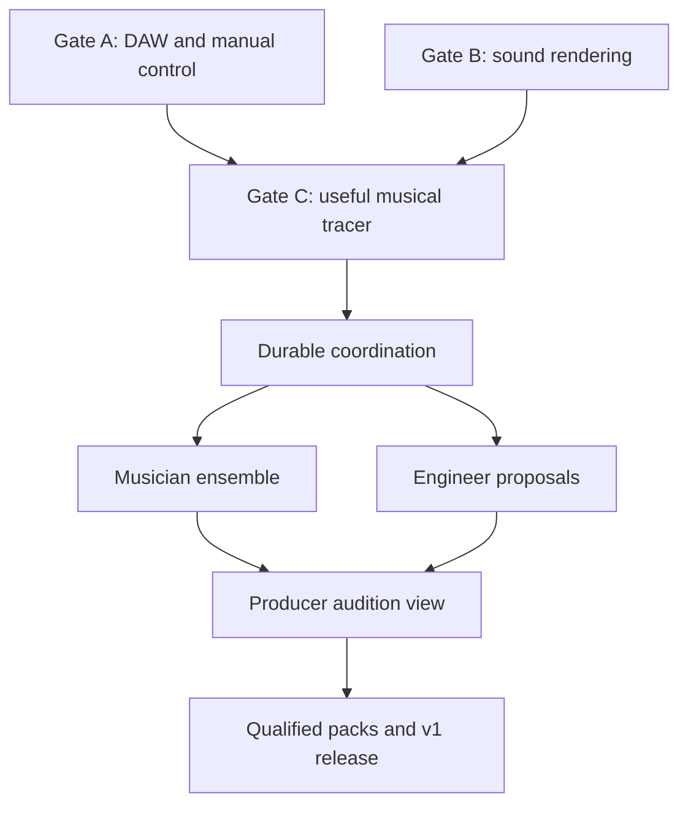

# Implementation plan

The issue tracker is the authority for work status. This document records the initial breakdown; all issues were created open and unstarted on 2026-09-04. See [SPEC.md](../SPEC.md) for requirements and qualification gates.

## Execution rule

Do the smallest real integration experiment first. Gate A and B investigations may proceed independently. Do not expand the coordinator, UI or agent framework until the eight-bar Gate C tracer is musically useful. Later issues harden the thin tracer; they are not prerequisites for building a complete platform before testing music.

## Epics

| Epic | Outcome | Implementation issues |
|---|---|---|
| [#1](https://github.com/cotyledonlab/llm-studio/issues/1) | [Epic 1] Prove free DAW integration and preserve producer control | [#8](https://github.com/cotyledonlab/llm-studio/issues/8), [#9](https://github.com/cotyledonlab/llm-studio/issues/9), [#10](https://github.com/cotyledonlab/llm-studio/issues/10), [#11](https://github.com/cotyledonlab/llm-studio/issues/11) |
| [#2](https://github.com/cotyledonlab/llm-studio/issues/2) | [Epic 2] Qualify background sound engines and isolated rendering | [#12](https://github.com/cotyledonlab/llm-studio/issues/12), [#13](https://github.com/cotyledonlab/llm-studio/issues/13), [#14](https://github.com/cotyledonlab/llm-studio/issues/14), [#15](https://github.com/cotyledonlab/llm-studio/issues/15) |
| [#3](https://github.com/cotyledonlab/llm-studio/issues/3) | [Epic 3] Deliver the eight-bar producer-led musical tracer | [#16](https://github.com/cotyledonlab/llm-studio/issues/16), [#17](https://github.com/cotyledonlab/llm-studio/issues/17), [#18](https://github.com/cotyledonlab/llm-studio/issues/18) |
| [#4](https://github.com/cotyledonlab/llm-studio/issues/4) | [Epic 4] Make session collaboration durable and recoverable | [#19](https://github.com/cotyledonlab/llm-studio/issues/19), [#20](https://github.com/cotyledonlab/llm-studio/issues/20), [#21](https://github.com/cotyledonlab/llm-studio/issues/21) |
| [#5](https://github.com/cotyledonlab/llm-studio/issues/5) | [Epic 5] Coordinate a bounded ensemble of musician agents | [#22](https://github.com/cotyledonlab/llm-studio/issues/22), [#23](https://github.com/cotyledonlab/llm-studio/issues/23), [#24](https://github.com/cotyledonlab/llm-studio/issues/24) |
| [#6](https://github.com/cotyledonlab/llm-studio/issues/6) | [Epic 6] Add an engineer and a practical audition workflow | [#25](https://github.com/cotyledonlab/llm-studio/issues/25), [#26](https://github.com/cotyledonlab/llm-studio/issues/26), [#27](https://github.com/cotyledonlab/llm-studio/issues/27) |
| [#7](https://github.com/cotyledonlab/llm-studio/issues/7) | [Epic 7] Qualify sounds and styles and ship a reproducible v1 | [#28](https://github.com/cotyledonlab/llm-studio/issues/28), [#29](https://github.com/cotyledonlab/llm-studio/issues/29), [#30](https://github.com/cotyledonlab/llm-studio/issues/30) |

## Dependency map

The issue-level dependencies below are authoritative for ordering; the diagram summarizes outcomes only.

## Detailed backlog

| ID | Issue | Blocked by | Priority |
|---|---|---|---|
| A1 | [#8 — Qualify a no-purchase macOS Ardour build and discover native APIs](https://github.com/cotyledonlab/llm-studio/issues/8) | None — starting task | P0 |
| A2 | [#9 — Implement a thin Ardour session adapter with stable IDs and mixer readback](https://github.com/cotyledonlab/llm-studio/issues/9) | [#8](https://github.com/cotyledonlab/llm-studio/issues/8) | P0 |
| A3 | [#10 — Prove automation read/write and a safe human-to-agent handoff](https://github.com/cotyledonlab/llm-studio/issues/10) | [#9](https://github.com/cotyledonlab/llm-studio/issues/9) | P0 |
| A4 | [#11 — Close Gate A with part replacement, save/reopen and export evidence](https://github.com/cotyledonlab/llm-studio/issues/11) | [#10](https://github.com/cotyledonlab/llm-studio/issues/10) | P0 |
| B1 | [#12 — Audit and reuse the SuperCollider connector for isolated stem rendering](https://github.com/cotyledonlab/llm-studio/issues/12) | None — starting task | P0 |
| B2 | [#13 — Select one Python plugin renderer through a bounded real-instrument bake-off](https://github.com/cotyledonlab/llm-studio/issues/13) | None — starting task | P0 |
| B3 | [#14 — Qualify a minimal drum, bass and keys instrument catalogue](https://github.com/cotyledonlab/llm-studio/issues/14) | [#12](https://github.com/cotyledonlab/llm-studio/issues/12), [#13](https://github.com/cotyledonlab/llm-studio/issues/13) | P0 |
| B4 | [#15 — Bound render jobs with cancellation, process isolation and alignment](https://github.com/cotyledonlab/llm-studio/issues/15) | [#14](https://github.com/cotyledonlab/llm-studio/issues/14) | P0 |
| C1 | [#16 — Define the minimal arrangement and performance contracts for eight bars](https://github.com/cotyledonlab/llm-studio/issues/16) | [#11](https://github.com/cotyledonlab/llm-studio/issues/11), [#15](https://github.com/cotyledonlab/llm-studio/issues/15) | P0 |
| C2 | [#17 — Wire takes, audible comparison and mix-preserving acceptance into Ardour](https://github.com/cotyledonlab/llm-studio/issues/17) | [#16](https://github.com/cotyledonlab/llm-studio/issues/16) | P0 |
| C3 | [#18 — Run Gate C: generate, direct, manually mix, revise and export music](https://github.com/cotyledonlab/llm-studio/issues/18) | [#17](https://github.com/cotyledonlab/llm-studio/issues/17) | P0 |
| D1 | [#19 — Persist immutable takes, revisions and durable local job state](https://github.com/cotyledonlab/llm-studio/issues/19) | [#18](https://github.com/cotyledonlab/llm-studio/issues/18) | P1 |
| D2 | [#20 — Implement versioned mix proposals with conflict checks and scoped authority](https://github.com/cotyledonlab/llm-studio/issues/20) | [#19](https://github.com/cotyledonlab/llm-studio/issues/19) | P1 |
| D3 | [#21 — Reconcile partial DAW writes, duplicate requests and safe undo](https://github.com/cotyledonlab/llm-studio/issues/21) | [#20](https://github.com/cotyledonlab/llm-studio/issues/20) | P1 |
| E1T | [#22 — Translate producer briefs into constrained arrangement plans and role briefs](https://github.com/cotyledonlab/llm-studio/issues/22) | [#19](https://github.com/cotyledonlab/llm-studio/issues/19) | P1 |
| E2T | [#23 — Implement drummer, bassist and keys roles with ensemble coordination](https://github.com/cotyledonlab/llm-studio/issues/23) | [#22](https://github.com/cotyledonlab/llm-studio/issues/22) | P1 |
| E3T | [#24 — Schedule bounded parallel generation with cancellation and cost limits](https://github.com/cotyledonlab/llm-studio/issues/24) | [#23](https://github.com/cotyledonlab/llm-studio/issues/23), [#21](https://github.com/cotyledonlab/llm-studio/issues/21) | P1 |
| F1 | [#25 — Add honest stem analysis and level-matched audio comparisons](https://github.com/cotyledonlab/llm-studio/issues/25) | [#19](https://github.com/cotyledonlab/llm-studio/issues/19) | P1 |
| F2 | [#26 — Implement the engineer's gain, pan and volume-envelope proposals](https://github.com/cotyledonlab/llm-studio/issues/26) | [#25](https://github.com/cotyledonlab/llm-studio/issues/25), [#21](https://github.com/cotyledonlab/llm-studio/issues/21) | P1 |
| F3 | [#27 — Build a minimal producer view for takes, jobs and proposals](https://github.com/cotyledonlab/llm-studio/issues/27) | [#26](https://github.com/cotyledonlab/llm-studio/issues/26), [#24](https://github.com/cotyledonlab/llm-studio/issues/24) | P1 |
| G1 | [#28 — Add versioned sound and style packs with human qualification](https://github.com/cotyledonlab/llm-studio/issues/28) | [#24](https://github.com/cotyledonlab/llm-studio/issues/24), [#27](https://github.com/cotyledonlab/llm-studio/issues/27) | P1 |
| G2 | [#29 — Exercise the full v1 regression and performance matrix on the real studio](https://github.com/cotyledonlab/llm-studio/issues/29) | [#28](https://github.com/cotyledonlab/llm-studio/issues/28) | P1 |
| G3 | [#30 — Document reproducible setup, recovery and the no-purchase release baseline](https://github.com/cotyledonlab/llm-studio/issues/30) | [#29](https://github.com/cotyledonlab/llm-studio/issues/29) | P1 |

## Where to begin

Start [A1](https://github.com/cotyledonlab/llm-studio/issues/8) on the target Mac. [B1](https://github.com/cotyledonlab/llm-studio/issues/12) and [B2](https://github.com/cotyledonlab/llm-studio/issues/13) are independent initial render investigations. All subsequent work follows explicit dependencies.

Gate A has a two-focused-session investigation budget. Gate B allows one focused session per renderer candidate. When a required capability is missing, report the evidence and decision needed. Do not substitute GUI automation, a flattened mix or an unapproved paid DAW.

## Issue contract

Every implementation issue contains why the work matters, its parent epic, dependency links, concrete implementation steps, acceptance criteria, verification/evidence requirements, excluded scope and relevant specification sections. Epics contain linked task lists and outcome gates.

A task checklist is not a substitute for runtime evidence. Pure tests cover contracts and deterministic logic; actual DAW/plugin behaviour needs real qualification. Musical usefulness additionally needs producer listening.

## Qualification reports

Create these as implementation proves the corresponding results; do not fabricate passing reports now:

- `docs/qualification/ardour-environment.md`
- `docs/qualification/gate-a.md`
- `docs/qualification/gate-b.md`
- `docs/qualification/musical-tracer.md`
- `docs/qualification/v1-acceptance.md`

Record versions, commands, observed results, audio evidence where redistributable, failures and limits. Keep private recordings and nonredistributable sounds outside the repository.
